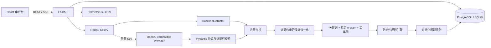

# 架构与关键权衡

- 当前首版把规范化后的 8 类状态统一保存为带 `kind/attrs/evidence` 的通用 JSON 记录，并按已完成运行投影关系图和时间线；尚未建立规范化的实体表、关系表或图数据库。这样保持本地部署简单，也避免把检索相似度误当成已成立的剧情关系。
- 确定性规则负责可复现的五类判断，模型只负责把普通故事文本转换为 8 类状态记录。未配置 Key 时完整基线仍可运行。
- 模型结果使用 Pydantic 判别联合验证，并由服务端根据 `source_line_start/end` 回填原文，不接受模型自己编造的证据正文。
- 模型增强按配置字符上限切为带原文全局行号的 `DocumentChunk`；行 overlap 记录按全局证据区间去重。单块失败只降级该块，超过上限明确 warning，而全文 baseline 始终执行。
- 顶层 envelope 严格限制为 `records`，数组内逐条隔离校验；单条错误只被跳过并记录安全警告，全部无效时才整体降级。
- Provider 对超时、429、5xx、空响应和非法 JSON 执行有限指数退避；字段非法或证据越界同样降级。默认 2 次 × 30 秒；一个分块终态失败即停止当前文档剩余模型分块，一个文档出现终态失败后打开本次运行熔断，后续文档直接使用全文基线。错误消息不包含 Key 或响应正文。
- 模型与基线通过规范化的类型、字段和证据区间去重；一次分析的最终记录持久化，展示层不会触发二次模型费用。
- 项目级 alias map 只读取明确“又名/简称/化名/代号”声明。归一化只改结构化实体字段，不改证据正文；循环或一名多主保留原名并警告。
- 本地混合检索使用关键词、SHA-256 稳定桶字符 n-gram 余弦和共享 canonical entity graph 三分。`CandidatePair` 进入五类检查器证据短名单并持久化 trace；精确 canonical 规则直达，避免 top-k 漏检。目前不生成新的模糊语义 issue。
- 模型/基线合并后还有一层不调用模型的候选归一化：把“取出工具并执行操作”映射为 `uses`，把范围内能力禁用规则和实际发动行为映射为共享 canonical key。该层只依据服务端原文证据生成状态，仍由规则引擎比较两侧证据后产生 issue。
- 基线对带“日志显示/记录记载”等报告前缀的显式时间—人物—地点句单独解析，报告来源不会再被并入人物名；地点在会面、检查等动作前保守截断。
- 持续身体状态使用 `body_state:<方向><部位族>` canonical key 对齐“失去肢体”与“完好同侧末端”，恢复、幻象和伪装措辞不进入该冲突候选。
- 移动许可使用 `fact/mobility_permission` 保存 actor、起终点/双向范围、状态和有效期；只有与冲突角色、地点对和事件时间全部匹配才抑制同刻异地。
- 信件、目击、告知、阅读和公告等明确来源统一为带来源类型和时间的 `knows`；规则例外使用 `fact/rule_exception` 绑定 actor、canonical rule key 与有效状态，`world_assert` 保留 actor。
- 普通 fact 若两侧都有不同明确时间，按状态迁移处理；持续无时间事实仍按原规则比较，避免恢复场景退化。
- `item`/`uses` 在规则检查前按实体、角色和证据区间去重，忽略可选时间措辞差异；最终 issue 再按类别、canonical metadata 与证据对去重。
- SSE 比 WebSocket 更适合单向进度流；事件持久化并同时接受 `Last-Event-ID` 请求头和 `last_event_id` 查询参数。终态事件携带 `status/error`，因此断线恢复后不会把失败误判为完成。
- 在线执行默认线程模式以降低本地门槛；Compose 预置 Celery worker，生产部署可切换为队列。
- 同名文档停用旧活动版本并创建递增版本；运行始终读取活动版本。项目、文档历史、运行历史与反馈审计是独立查询边界，前端刷新不依赖内存状态。
- 版本差异使用 Python `SequenceMatcher` 在服务端做确定性的行级比较，只允许同一项目、同名文件的两个不同版本。响应提供版本元数据、增删/未变行统计和带上下文的 hunk，不进入抽取管线或 Provider。为限制内存与页面体积，默认每个版本比较前 20,000 行/2,000,000 字符、最多输出 4,000 行；截断范围与摘要口径会显式返回 warning。
- 取消请求幂等，但终态任务返回 `409`；重试只接受 `failed/cancelled` 任务，并通过同一调度入口尊重 `USE_CELERY`。
- 所有问题必须附 `EvidenceSpan`；无证据的模型输出不得进入最终问题列表。
- 模型逐块前执行单次 Token 预算门控；Provider 不返回 usage 时按本地保守估算计入门控。每日额度和滑动窗口限流当前只保证本地单实例行为，多实例部署必须替换为 Redis/事务式原子配额。
- 成本只有在输入、输出单价均配置时才计算；未配置价格与真实零成本在 API 中严格区分。
- 关系图与时间线只读取某次已完成运行持久化的状态记录，不调用 Provider。图使用类型命名空间稳定节点 ID，每条边保留记录 ID、证据与关联问题；相对/无时间记录进入“时间未确定”区，不做虚假排序。当前响应限制为 500 节点/1000 边，超限显式返回 warning。

## 当前扩展边界

`NarrativeExtractor`、`ConsistencyChecker` 与 Provider 是独立边界。当前已有按文档分块和显式别名归一化，但尚无真实 embedding/pgvector、隐含实体消歧、跨块上下文摘要、置信度校准和真实模型长文人工标注评测；这些仍是模型增强 Alpha 的主要风险，不能用 Mock 或生成型 smoke 替代。
