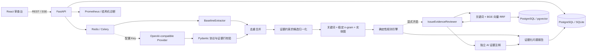

# 架构与关键权衡

- 当前首版把规范化后的 8 类状态统一保存为带 `kind/attrs/evidence` 的通用 JSON 记录，并按已完成运行投影关系图和时间线；尚未建立规范化的实体表、关系表或图数据库。这样保持本地部署简单，也避免把检索相似度误当成已成立的剧情关系。
- 确定性规则负责可复现的五类判断，模型只负责把普通故事文本转换为 8 类状态记录。未配置 Key 时完整基线仍可运行。
- 模型结果使用 Pydantic 判别联合验证，并由服务端根据 `source_line_start/end` 回填原文，不接受模型自己编造的证据正文。
- 模型增强按配置字符上限切为带原文全局行号的 `DocumentChunk`；行 overlap 记录按全局证据区间去重。单块失败只降级该块，超过上限明确 warning，而全文 baseline 始终执行。
- 顶层 envelope 严格限制为 `records`，数组内逐条隔离校验；单条错误只被跳过并记录安全警告，全部无效时才整体降级。
- Provider 对超时、429、5xx、空响应和非法 JSON 执行有限指数退避；字段非法或证据越界同样降级。默认 2 次 × 30 秒；一个分块终态失败即停止当前文档剩余模型分块，一个文档出现终态失败后打开本次运行熔断，后续文档直接使用全文基线。错误消息不包含 Key 或响应正文。
- 模型与基线通过规范化的类型、字段和证据区间去重；一次分析的最终记录持久化，展示层不会触发二次模型费用。
- 项目级 alias map 只读取明确“又名/简称/化名/代号”声明。归一化只改结构化实体字段，不改证据正文；循环或一名多主保留原名并警告。
- 本地候选排序继续使用关键词、SHA-256 稳定桶字符 n-gram 余弦和共享 canonical entity graph 三分。`CandidatePair.consumed` 仅表示类型兼容，确定性裁决仍调用全量 `detect_issues`；这条主路没有被向量相似度替代。
- Evidence RAG 是与确定性裁决解耦、默认关闭的后置通路：独立显式配置的 OpenAI-compatible embedding client、中文确定性行号分块、版本化 embedding profile，以及按项目、文档、版本、内容哈希和 chunker 精确隔离的 chunk/vector schema；PostgreSQL 使用真实 `vector` 列并执行精确余弦搜索，关键词与 dense 候选通过 RRF 合并。真实固定 BGE embedding、索引复用、pgvector 检索和隔离负例均已运行。
- `IssueEvidenceReviewer` 在规则引擎已经产生 issue 后才工作。它从本次运行冻结快照中检索获授权证据，用服务端签发的引用标签调用同一结构化模型合同，并把 `supports_issue`、`contextual_exception` 或 `insufficient_evidence` 保存到 issue 的 `metadata.ai_evidence_review`。它不会删除、改写 issue 的类别、严重度、证据或建议；检索、模型或校验失败时保留原规则报告并记录降级诊断。
- Evidence Reviewer 由 `ENABLE_ISSUE_EVIDENCE_REVIEW` 显式开启，默认 `false`；默认还要求真正的 hybrid 检索。Key、endpoint、Prompt、原文和模型原始响应不进入持久化注释或公开评测报告。
- 模型/基线合并后还有一层不调用模型的候选归一化：把“取出工具并执行操作”映射为 `uses`，把范围内能力禁用规则和实际发动行为映射为共享 canonical key。该层只依据服务端原文证据生成状态，仍由规则引擎比较两侧证据后产生 issue。
- 基线对带“日志显示/记录记载”等报告前缀的显式时间—人物—地点句单独解析，报告来源不会再被并入人物名；地点在会面、检查等动作前保守截断。
- 持续身体状态使用 `body_state:<方向><部位族>` canonical key 对齐“失去肢体”与“完好同侧末端”，恢复、幻象和伪装措辞不进入该冲突候选。
- 移动许可使用 `fact/mobility_permission` 保存 actor、起终点/双向范围、状态和有效期；只有与冲突角色、地点对和事件时间全部匹配才抑制同刻异地。
- 信件、目击、告知、阅读和公告等明确来源统一为带来源类型和时间的 `knows`；规则例外使用 `fact/rule_exception` 绑定 actor、canonical rule key 与有效状态，`world_assert` 保留 actor。
- 普通 fact 若两侧都有不同明确时间，按状态迁移处理；持续无时间事实仍按原规则比较，避免恢复场景退化。
- `item`/`uses` 在规则检查前按实体、角色和证据区间去重，忽略可选时间措辞差异；最终 issue 再按类别、canonical metadata 与证据对去重。
- SSE 比 WebSocket 更适合单向进度流；事件持久化并同时接受 `Last-Event-ID` 请求头和 `last_event_id` 查询参数。终态事件携带 `status/error`，因此断线恢复后不会把失败误判为完成。
- `/metrics` 的运行数、持久化终态事件与终态耗时在抓取时从共享数据库派生，而不是依赖 API/worker 各自的内存 Counter。状态标签使用固定集合，缺少合法起止时间的终态运行单独计数；数据库不可读时返回 503，不输出伪造的零值。详细语义见 [`observability.md`](observability.md)。
- 在线执行默认线程模式以降低本地门槛；Compose 预置 Celery worker，生产部署可切换为队列。
- 同名文档停用旧活动版本并创建递增版本；运行始终读取活动版本。项目、文档历史、运行历史与反馈审计是独立查询边界，前端刷新不依赖内存状态。
- 版本差异使用 Python `SequenceMatcher` 在服务端做确定性的行级比较，只允许同一项目、同名文件的两个不同版本。响应提供版本元数据、增删/未变行统计和带上下文的 hunk，不进入抽取管线或 Provider。为限制内存与页面体积，默认每个版本比较前 20,000 行/2,000,000 字符、最多输出 4,000 行；截断范围与摘要口径会显式返回 warning。
- 取消请求幂等，但终态任务返回 `409`；重试只接受 `failed/cancelled` 任务，并通过同一调度入口尊重 `USE_CELERY`。
- 所有问题必须附 `EvidenceSpan`；无证据的模型输出不得进入最终问题列表。
- 模型逐块前执行单次 Token 预算门控；Provider 不返回 usage 时按本地保守估算计入门控。每日额度和滑动窗口限流当前只保证本地单实例行为，多实例部署必须替换为 Redis/事务式原子配额。
- 成本只有在输入、输出单价均配置时才计算；未配置价格与真实零成本在 API 中严格区分。
- 关系图与时间线只读取某次已完成运行持久化的状态记录，不调用 Provider。图使用类型命名空间稳定节点 ID，每条边保留记录 ID、证据与关联问题；相对/无时间记录进入“时间未确定”区，不做虚假排序。当前响应限制为 500 节点/1000 边，超限显式返回 warning。

## 当前扩展边界

`NarrativeExtractor`、`ConsistencyChecker`、Embedding Provider、Evidence Retriever 与 Chat Provider 是独立边界。当前已经形成“规则 issue → 授权快照检索 → 模型证据复核 → 独立注释”的真实消费闭环，但没有把概率模型变成事实裁决者。首次冻结 retrieval holdout 的混合 Recall@5 为 81.82%、All-evidence@5 为 71.43%、低词面 Recall@5 为 79.31%，最后一项差 1 条未过门槛；12 例 Evidence Reviewer A/B 从 4/12 提升至 7/12，但绝对 gate 失败且 `insufficient_evidence` 为 0/4。隐含实体消歧、查询分解、跨块摘要、置信度校准、真实长文人工盲测和生产高并发仍是明确边界，不作为当前继续扩功能的理由。
